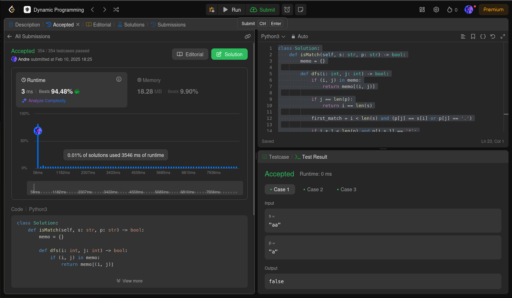
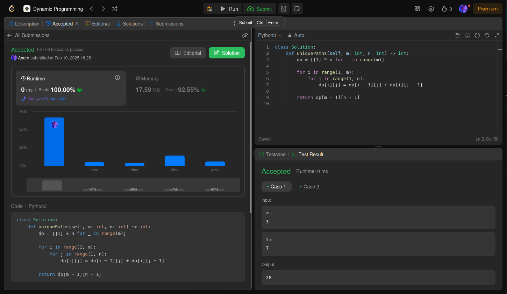

# PD - LeetCode

**Número da Lista**: 5 
**Conteúdo da Disciplina**: Programação Dinâmica 

## Alunos
|Matrícula | Aluno |
| -- | -- |
| 22/2037648   |  André Cláudio Maia da Cunha |
| 211062713  |  Paola Nascimento |

## Sobre 
Para este trabalho, a dupla irá realizar exercícios de programação do LeetCode, praticando algoritmos que sigam a intuição de Programação Dinâmica. Foram soluionados quatro problemas, dois considerados nível 'Hard' e dois 'Medium'.

- [Problema 131. Palindrome Partitioning](https://leetcode.com/problems/palindrome-partitioning/description/?envType=problem-list-v2&envId=dynamic-programming)
- [Problema 132. Palindrome Partitioning II](https://leetcode.com/problems/palindrome-partitioning-ii/description/?envType=problem-list-v2&envId=dynamic-programming)
- [Problema 10](https://leetcode.com/problems/regular-expression-matching/description/?envType=problem-list-v2&envId=dynamic-programming)
- [Problema 62](https://leetcode.com/problems/unique-paths/description/?envType=problem-list-v2&envId=dynamic-programming)

## Screenshots
### Problema 131

### Problema 132

### Problema 10

### Problema 62

## Instalação 
**Linguagem**: Python 3 

## Uso 
Copie o código da questão e cole no respectivo problema no LeetCode. Após isso, clique em "submit" para ver o Online Judge verificando se a solução é válida.

## Link do Vídeo

[Clique Aqui!](https://youtu.be/kWZyjU1n1Qo)

